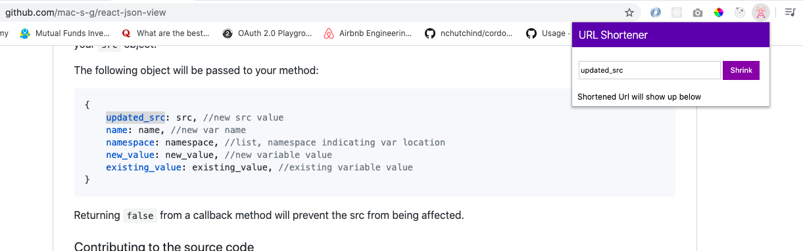
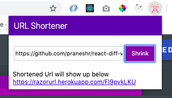

## URL Shortner Chrome Extension

A URL shortener chrome extension to shorten any long urls. 
You can select any url from the page and it will automatically append in the url shortener text box to shorten or you can manually paste your desired url

## How it works:
Select any url or text and it automatically copies to the textbox in the extension. 

Manually paste url and shorten 

## Download

